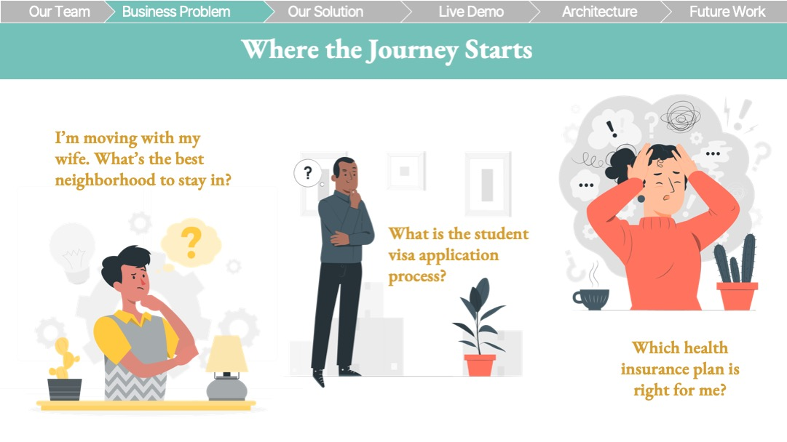
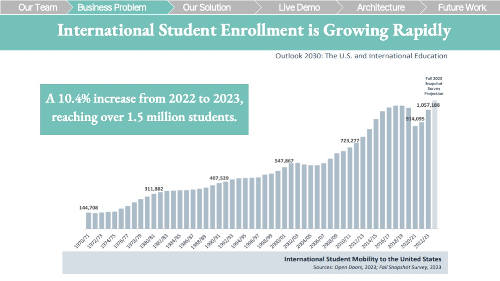
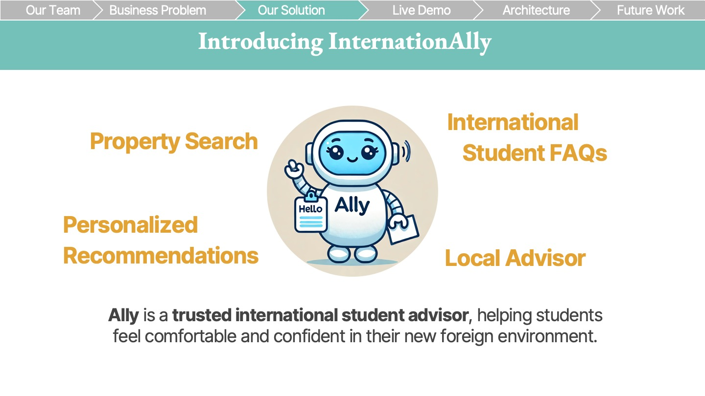
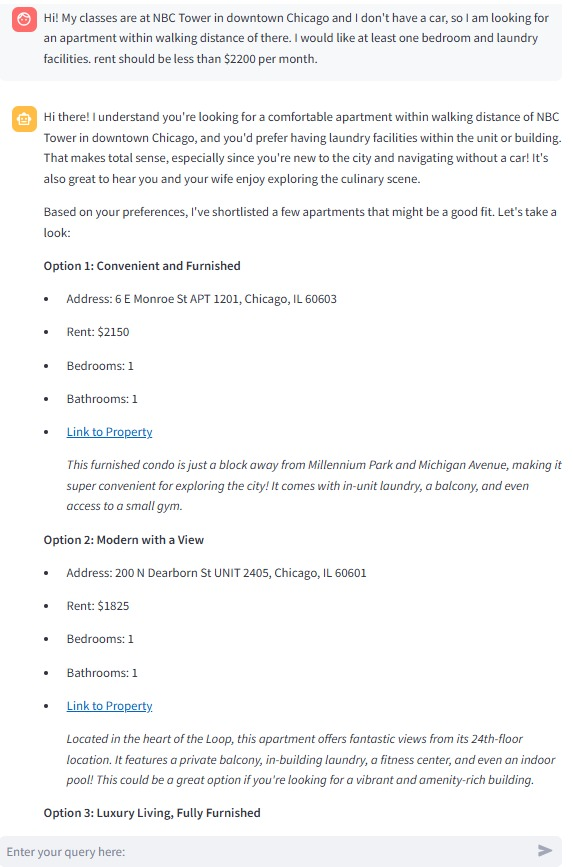
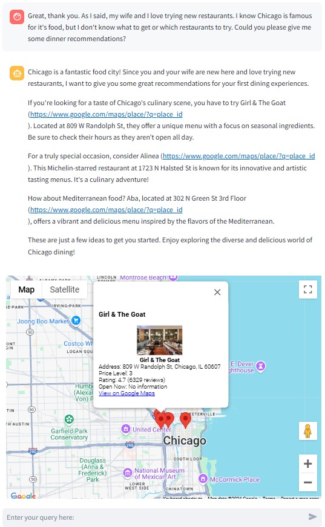
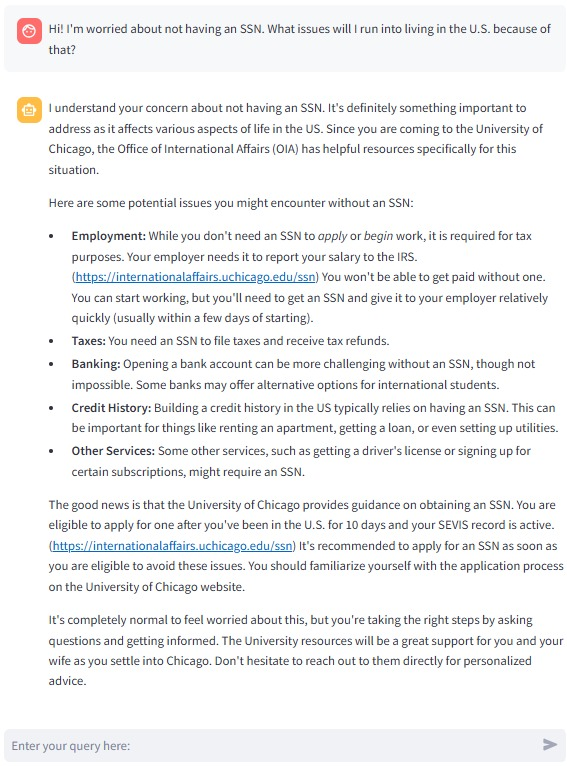

  <h1 style="font-size: 48px; font-weight: bold;">InternationAlly: AI-Powered Companion for International Students Moving Abroad</h1>

  

**InternationAlly** is an AI-powered trusted international student advisor, helping students feel comfortable and confident in their new foreign environment.

## Table of Contents
- [1. Motivation](#1-motivation)
  - [Background](#background)
  - [Common Challenges Faced by International Students](#common-challenges-faced-by-international-students)
  - [Goals](#goals)
  - [Differentiators](#differentiators)
- [2. Overview of InternationAlly](#2-overview-of-internationally)
  - [Data](#data)
  - [Key Features](#key-features)
  - [Methodology](#methodology)
- [4. Evaluation & Testing](#4-evaluation--testing)
- [5. User Interface ](#5-user-interface)
- [6. Future Work](#6-future-work)
- [7. Conclusion](#7-conclusion)
- [8. References](#8-references)
- [9. Acknowledgements/About Us](#9-acknowledgementsabout-us)

  
## 1. Motivation 🌎

### Background

Our project, InternationAlly, was inspired by the personal experiences of our team—three international students who faced common challenges while studying abroad. From finding affordable housing and navigating unfamiliar cities to understanding visa requirements, we struggled to find reliable resources to answer our questions. This inspired us to develop a chatbot solution that could help international students with these issues. 

  

Research shows that international student enrollment in the U.S. is rapidly growing, with over 1.5 million students, contributing significantly to the economy. This expanding student population highlights a clear demand for solutions like InternationAlly. By providing accessible, smart support, InternationAlly aims to help international students navigate both academic and everyday challenges.

  

### Common Challenges Faced by International Students

- **Legal and Visa Requirements**: Questions like "What are the steps to apply for an F-1 student visa?" or "How do I maintain my visa status while studying?"
- **Housing**: Finding safe, affordable housing, understanding lease agreements, and determining the documents needed for renting.
- **Cultural Differences**: Navigating cultural norms, understanding social etiquette, and overcoming language barriers.
- **Logistical Issues**: Setting up bank accounts, getting health insurance, finding transportation options, and more.

  

InternationAlly bridges these gaps by providing tailored housing options, local insights, and essential support throughout a student's move.

### Goals & Value Proposition

**InternationAlly** aims to:

- Provide an **efficient and comprehensive** way for international students to secure housing.
- Offer **guidance** on legal, cultural, and logistical matters to help students adapt smoothly.
- Act as a **trusted friend and advisor**, simplifying the complexities of moving abroad.

  

## 2. Overview of InternationAlly 🗺️

  

### Data

- **Housing Data**: Aggregated from platforms like Zillow, tailored to meet the preferences of international students.
- **Local Information**: Collected from reliable sources to provide insights into neighborhoods, schools, transportation, and cultural hotspots.
- **Legal and Logistical Content**: Curated from official websites and verified resources to offer accurate guidance on visas, legal rights, and essential services.
- **Cultural Resources**: Compiled from blogs, forums, and community guides to assist with cultural adaptation.

### Key Features

- **Efficient Housing Search**: Natural language property search converting user input into specific filters.
- **Comprehensive Guidance**: Offers legal, cultural, and logistical support to help students adapt to their new environment.
- **Multilingual Support**: Provides assistance in multiple languages to cater to non-native English speakers.
- **Personalized Assistance**: AI-driven recommendations and advice tailored to individual needs and preferences.
- **Community Connection**: Facilitates connections with other international students and local communities.

### Methodology

- **Retrieval-Augmented Generation (RAG)**: Implemented to provide accurate and context-specific information by integrating a language model with a retrieval system.
- **Large Language Models (LLMs)**: Utilizing Gemini 1.5 Pro for natural language understanding and generation.
- **Multi-Shot Prompting**: Employed to convert user input into actionable queries for APIs like Zillow.
- **Data Integration**: Combining various data sources to create a cohesive and comprehensive knowledge base.

## 3. User Interface 💻

### Application

[**Link to Streamlit App**](https://property-pilot-app-617571939826.us-central1.run.app/)

### Demo

[**Click here to watch the demo video**](Documents/Live_Demo.mp4)

  

  

  

  

  

## 4. Evaluation & Testing 📊

### Evaluation Framework and Results

To ensure **InternationAlly** provides accurate, relevant, and helpful responses, we conducted a comprehensive evaluation and testing process that included both automated assessments using Large Language Models (LLMs) and user testing with international students.

**Evaluation Objectives**
We focused on evaluating the following key features:
- **Property Search:** Ability to provide property listings that accurately match user criteria.
- **Local Advisor:** Offering relevant recommendations for local amenities and services.
- **International Student Advisor:** Providing accurate guidance on legal, cultural, and logistical matters.
- **General Queries:** Handling miscellaneous questions while maintaining appropriate tone and professionalism.

**Evaluation Metrics**
We defined the following metrics to assess the quality of responses:
1. **Relevance:** How directly the response addresses the user's specific question or request.
2. **Accuracy:** The correctness and up-to-dateness of the information provided.
3. **Clarity:** The ease with which the user can understand the response.
4. **Completeness:** Whether the response fully addresses all parts of the user's question.
5. **Tone and Empathy:** The appropriateness of the response's tone and the level of empathy shown towards the user.
Each response was scored on a scale from 0 to 100 for each metric.

**Automated Evaluation Using GPT 4o**
We customized a "GPT" on ChatGPT to act as an evaluator to assess the responses generated by InternationAlly:
[**InternationAlly GPT Evaluator**](https://chatgpt.com/g/g-674265ee4f108191af0363b4b5c228e3-internationally-evaluator)

**Evaluation Process:**

The evaluator was provided with [this structured prompt](evaluation/llm_evaluator_prompt.txt) to evaluate each response based on the defined metrics, generating scores along with brief justifications for each.

1. Preparation of Test Queries: Compiled [this set of representative user queries](evaluation/eval_user_queries.txt) covering all key features.
2. Response Generation: InternationAlly generated responses to each query.
3. LLM Evaluation: The LLM evaluators assessed each response using the [evaluation metrics](evaluation/eval_metrics.txt).
4. Analysis: Analyzed scores and feedback to identify areas for improvement

**Evaluation Results**

This bar chart illustrates the performance of each feature across the evaluation metrics. Overall, InternationAlly performs consistently well across most metrics, with scores typically ranging between 70 and 100. With high performance across features, Clarity and Tone & Empathy are InternationAlly's forte. However, our evaluation also helped to highlight the areas where InternationAlly still has room for improvement.

### User Testing

We conducted user testing to gather real-world feedback on usability and relevance.

**Users**:

We recruited international students friends from diverse backgrounds and programs at the University of Chicago.
Participants were informed about the purpose and consented to provide feedback.

**Testing Process:**

**Simulated Scenarios:** Participants were asked to imagine planning their move to the U.S. and interact with InternationAlly to accomplish tasks such as:
- Finding suitable housing within their budget.
- Asking logistical questions about moving to the U.S. (e.g., setting up bank accounts, phone plans).
- Exploring local amenities like restaurants and grocery stores.
- Open Exploration: Allowed users to explore the app freely and ask any questions they might have.

**Data Collection:**
- Observations: Noted user interactions, difficulties, and any confusion.
- Think-Aloud Protocol: Encouraged participants to verbalize their thoughts while using the app.
- [Survey](https://forms.gle/nit8BcmzLkr1wan98): Collected quantitative and qualitative feedback through a post-testing survey.
- Interviews: Conducted brief interviews to delve deeper into users' experiences.

**User Feedback**
- Users appreciated the personalized assistance and found the app helpful for planning their move.
- Helped to idenify areas where responses lacked accuracy or completeness, especially in legal and logistical guidance. This helped us to refine prompts and prioritize new data sources to add.
- Received great suggestions for ways to improve the navigation and visual appeal of the app to enhance the user experience

This comprehensive evaluation and testing process allowed us to refine InternationAlly, ensuring it meets the needs of international students by providing accurate, relevant, and empathetic support throughout their transition.

## 5. Differentiators ✨

Over the past several months, the capabilities of foundational Large Language Models (LLMs) have improved rapidly. Features like real-time web search and advanced data processing, which were not available when we began developing InternationAlly, are now more common. However, despite these advancements, InternationAlly continues to stand out due to several key differentiators:

1. **Personalized and Specific Recommendations:** InternationAlly provides highly tailored advice and recommendations that are specifically tied to each user's individual situation. Unlike general-purpose LLMs such as Google Gemini which often require the user to remind the model of their details and situation, our platform considers the unique needs, preferences, and circumstances of international students. This ensures that every piece of advice is relevant, actionable, and directly applicable to the user's journey.

2. **Warm Tone and Empathetic Support:** While foundational LLMs can adopt a friendly tone if prompted, this requires extra effort from the user and may feel inauthentic. InternationAlly maintains a warm, friendly, and helpful demeanor by default. Our assistant is designed to offer empathetic support, making users feel understood and cared for without the need for additional prompting. This consistent, caring personality provides a more personalized and comforting experience.

3. **School-Specific Data and Answers:** InternationAlly can be tailored to the needs of individual universities, ingesting school-specific data and providing targeted answers. For example:

  - Housing recommendations that reflect the unique housing market near a particular campus.
  - Insights into local amenities and transportation tailored to the school’s surrounding neighborhoods.
  - Answers to logistical questions that reflect the specific policies and resources of a given university.

 By ingesting school-specific web pages and resources, we provide accurate, up-to-date, and detailed information relevant to a student's particular institution. This level of specificity is not typically available in general-purpose LLMs, making InternationAlly an invaluable resource for navigating school-related matters.

4. **Specialized Focus:** InternationAlly is purpose-built for international students, addressing their specific challenges and needs.  Unlike generic real estate platforms or LLMs that provide broad information, InternationAlly offers specialized support in housing, legal guidance, cultural adaptation, and logistical assistance—all in one place.

In summary, while foundational LLMs have become more capable, InternationAlly offers a level of personalization, empathy, and specialized knowledge that sets it apart. Our focus on the unique journey of international students makes us an indispensable ally in navigating the complexities of moving abroad.

## 6. Future Work 🚀

- **PropertyPilot's Vision: Expanded Product Offerings**
  - Develop additional specialized agents catering to diverse user groups such as first-time homebuyers, recent graduates, and military families.
  - Create an integrated platform where users can access tailored real estate assistance.
- **Expand Cities/Schools**:
  - Extend InternationAlly's services to other major cities and universities across the United States and eventually globally.
- **Enhanced AI Capabilities**:
  - Integrate more advanced AI models to improve personalization and accuracy.
- **Community Features**:
  - Introduce forums and events to foster community among international students.
- **Partnerships**:
  - Collaborate with universities, housing providers, and service companies to offer exclusive benefits to users.

  

## 7. Conclusion 🎓

**InternationAlly** provides international students with a convenient, comprehensive, and personalized way to navigate the challenges of moving abroad. By combining advanced technology with expert guidance, our platform empowers students to make informed decisions and confidently embark on their academic journeys. InternationAlly not only facilitates housing searches but also offers essential support in legal matters, cultural adaptation, and logistical arrangements, making it an indispensable tool for international students.

Convert uncertainty into confidence with InternationAlly — your ally abroad.

## 8. References

- **Data Sources**:
  - Zillow API
  - Local government and university websites
  - Cultural blogs and forums
  - Neighborhood safety information from resources like NeighborhoodScout

- **Technologies Used**:
  - Gemini 1.5 Pro LLM
  - Retrieval-Augmented Generation (RAG) methodology

## 9. Acknowledgements/About Us

**InternationAlly** is developed by:

- **Kshitiz Sahay** (sahayk@uchicago.edu)
- **Daichi Ishikawa** (daichi@uchicago.edu)
- **Yijing Sun** (yijingsun@uchicago.edu)
- **William DeForest** (wdeforest@uchicago.edu)

**Advised by**:

- **Nick Kadochnikov**
- **Egehan Yorulmaz**
- **Scott Howard**

We are students in the Applied Data Science Master's program at the University of Chicago, working on this project as part of the Conversational AI Research Capstone Course.

---
