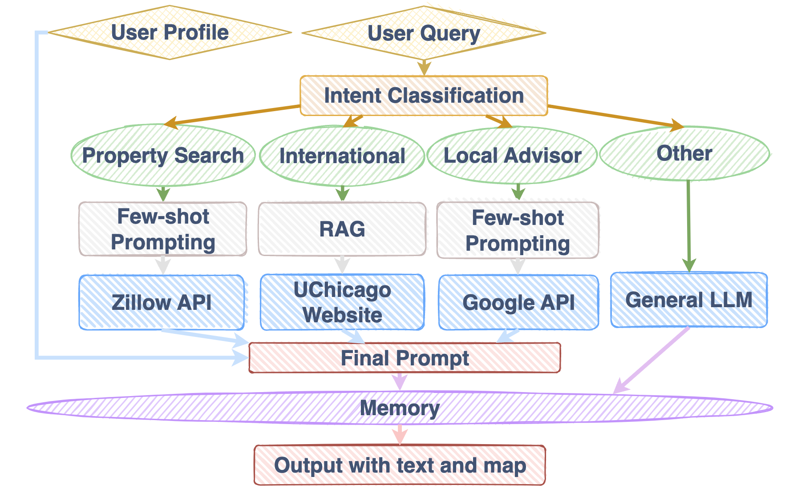
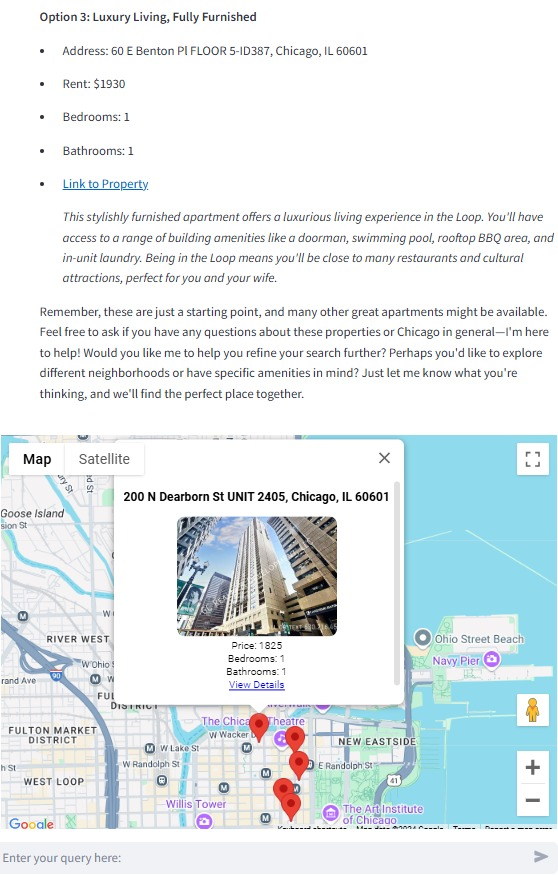
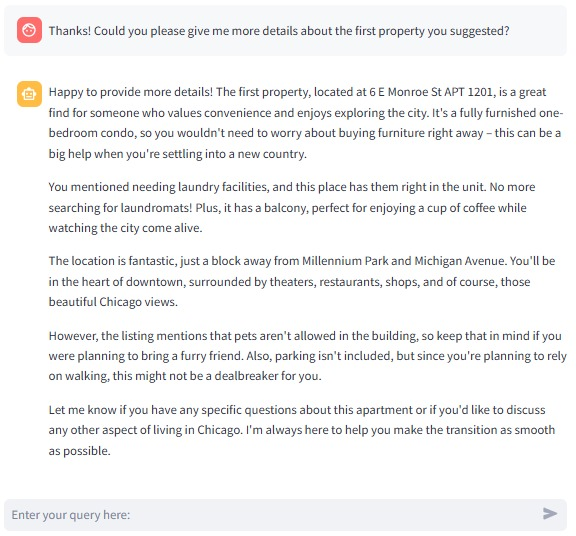
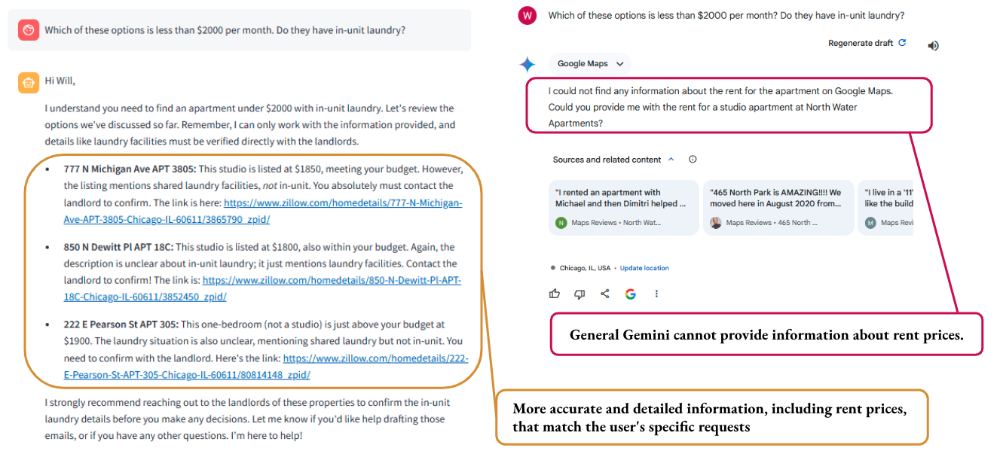
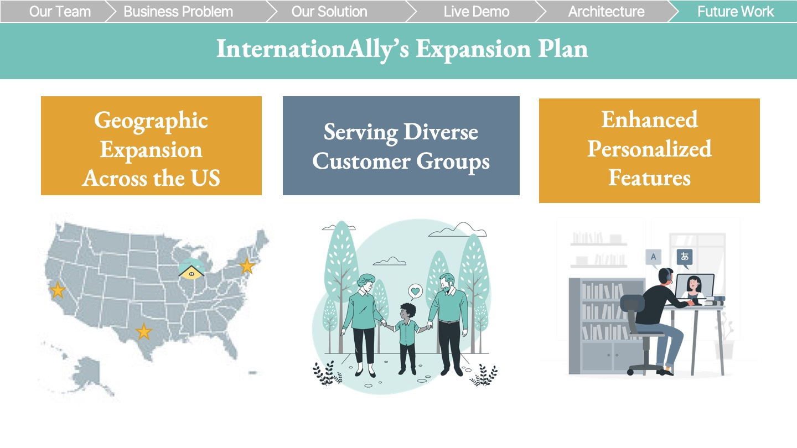

  <h1 style="font-size: 48px; font-weight: bold;">InternationAlly: AI-Powered Companion for International Students Moving Abroad</h1>

  

**InternationAlly** is an AI-powered trusted international student advisor, helping students feel comfortable and confident in their new foreign environment.

## Table of Contents
- [1. Motivation 🌎](#1-motivation-)
  - [Background](#background)
  - [Common Challenges Faced by International Students](#common-challenges-faced-by-international-students)
  - [Goals & Value Proposition](#goals--value-proposition)
- [2. Overview of InternationAlly 🗺️](#2-overview-of-internationally-%EF%B8%8F)
  - [Key Features](#key-features)
  - [Methodology](#methodology)
  - [Data](#data)
  - [Code Structure](#code-structure)
- [3. User Interface 💻](#3-user-interface-)
  - [Application](#application)
  - [Demo](#demo)
- [4. Evaluation & Testing 📊](#4-evaluation--testing-)
  - [Evaluation Framework and Results](#evaluation-framework-and-results)
  - [User Testing](#user-testing)
- [5. Differentiators ✨](#5-differentiators-)
  - [Comparison with Gemini 1.5 Pro](#comparison-with-gemini-15-pro)
- [6. Future Work 🚀](#6-propertypilots-vision-future-work-and-expansion-)
- [7. Conclusion 🎓](#7-conclusion-)
- [8. Tools Used 🛠️](#8-tools-used-%EF%B8%8F)
- [9. References 📚](#9-references-)
- [10. Acknowledgements/About Us 👤](#10-acknowledgementsabout-us-)

  
## 1. Motivation 🌎

### Background

Our project, InternationAlly, was inspired by the personal experiences of our team—three international students who faced common challenges while studying abroad. From finding affordable housing and navigating unfamiliar cities to understanding visa requirements, we struggled to find reliable resources to answer our questions. This inspired us to develop a chatbot solution that could help international students with these issues. 

  

Research shows that international student enrollment in the U.S. is rapidly growing, with over 1.5 million students, contributing significantly to the economy. This expanding student population highlights a clear demand for solutions like InternationAlly. By providing accessible, smart support, InternationAlly aims to help international students navigate both academic and everyday challenges.

  

### Common Challenges Faced by International Students

- **Legal and Visa Requirements**: Questions like "What are the steps to apply for an F-1 student visa?" or "How do I maintain my visa status while studying?"
- **Housing**: Finding safe, affordable housing, understanding lease agreements, and determining the documents needed for renting.
- **Cultural Differences**: Navigating cultural norms, understanding social etiquette, and overcoming language barriers.
- **Logistical Issues**: Setting up bank accounts, getting health insurance, finding transportation options, and more.

  

InternationAlly bridges these gaps by providing tailored housing options, local insights, and essential support throughout a student's move.

### Goals & Value Proposition

**InternationAlly** aims to:

- Provide an **efficient, user-friendly platform** for international students to explore and secure housing options tailored to their unique needs.
- Offer **tailored, local advice** that considers unique regional contexts, helping students connect with their new communities and access the most relevant services and amenities.
- Deliver **reliable guidance** on navigating legal, cultural, and logistical challenges, empowering students to adapt seamlessly to their new environment.
- Serve as a **trusted companion**, blending empathy and expertise to simplify the complexities of moving abroad and ensuring students feel supported every step of the way.

Together, these goals ensure that InternationAlly provides a holistic and user-focused solution for international students navigating the challenges of moving abroad.

  

## 2. Overview of InternationAlly 🗺️

  

### Key Features

- **Housing Search:** Seamlessly search for housing tailored to international students' needs. The system converts free-form user input into specific filters for finding ideal properties using the Zillow API. Listings include detailed insights on proximity to universities, transportation options, and local amenities.
- **Local Advice:** Receive curated recommendations for essential services and popular destinations. From grocery stores to cultural hotspots, the app leverages Google Maps APIs to deliver advice tailored to users’ preferences and location, helping them navigate their new environment with confidence.
- **International Student Guidance:** Navigate the complexities of moving abroad with comprehensive support on legal, cultural, and logistical matters. Whether it’s understanding visa requirements, setting up a bank account, or adapting to local customs, InternationAlly offers step-by-step guidance backed by trusted resources.
- **Interactive Google Map:** Explore housing and local amenities through an embedded interactive Google Map. By plotting results from the property search and local advisor features, this tool helps users visualize everything more intuitively for better decision-making.

### Methodology

- **Large Language Models (LLMs)**: Leveraged Gemini 1.5 Flash for natural language understanding and generation. By using the Flash model, we successfully reduced latency compared to the Pro model.
- **Multi-Shot Prompting**: Applied multi-shot prompting to convert user input into actionable queries for APIs like Zillow and Google. This approach allowed us to process complex free-form text from users and transform it into the appropriate format for these APIs. By iteratively using LLMs for specific tasks, we ensured consistent and accurate outputs.
- **Retrieval-Augmented Generation (RAG)**: Integrated a language model with a retrieval system to provide accurate and context-specific information. Using the University of Chicago website as a reliable data source, we built a RAG system to deliver trustworthy information for international students. By incorporating RAG Fusion techniques such as Query Rewriting and Re-ranking, we significantly enhanced accuracy. Additionally, responses included links for fact validation, and hallucination was minimized through carefully crafted prompts.
- **API Integration**: Leveraged APIs to ensure users always have access to the latest, most reliable information.

### Data

- **Housing Data**: Real-time listing information retrieved from Zillow via the [Rapid Zillow.Com API](https://rapidapi.com/apimaker/api/zillow-com1).
- **Local Information**: Real-time Google Search results retrieved via the [Google Maps Platform Text Search API](https://developers.google.com/maps/documentation/places/web-service/search-text). Results provide insights into businesses, neighborhoods, schools, transportation, and cultural hotspots.
- **Maps**: Embedded Google Maps created using [Google Maps Platform JavaScript API](https://developers.google.com/maps/documentation/javascript).
- **Legal and Logistical Content**: Curated from [University of Chicago and Government websites](documents\international_advisor_data_sources.txt) to offer accurate guidance on visas, legal rights, and essential services.

### Code Structure

- For more information on how the code is structured and the purpose of each file, please refer to the [Code Structure Documentation](./app/code_structure.md).

## 3. User Interface 💻

### Application

[**Link to Streamlit App**](https://property-pilot-app-final-617571939826.us-central1.run.app/)

### Demo

[**Click here to watch the demo video**](documents/Live_Demo.mp4)

  

  

  

  

  

## 4. Evaluation & Testing 📊

### Evaluation Framework and Results

To ensure **InternationAlly** provides accurate, relevant, and helpful responses, we conducted a comprehensive evaluation and testing process that included both automated assessments using Large Language Models (LLMs) and user testing with international students.

**Evaluation Objectives**
We focused on evaluating the following key features:
- **Property Search:** Ability to provide property listings that accurately match user criteria.
- **Local Advisor:** Offering relevant recommendations for local amenities and services.
- **International Student Advisor:** Providing accurate guidance on legal, cultural, and logistical matters.
- **General Queries:** Handling miscellaneous questions while maintaining appropriate tone and professionalism.

**Evaluation Metrics**
We defined the following metrics to assess the quality of responses:
1. **Relevance:** How directly the response addresses the user's specific question or request.
2. **Accuracy:** The correctness and up-to-dateness of the information provided.
3. **Clarity:** The ease with which the user can understand the response.
4. **Completeness:** Whether the response fully addresses all parts of the user's question.
5. **Tone and Empathy:** The appropriateness of the response's tone and the level of empathy shown towards the user.
Each response was scored on a scale from 0 to 100 for each metric.

**Automated Evaluation Using GPT 4o**
We customized a "GPT" on ChatGPT to act as an evaluator to assess the responses generated by InternationAlly:
[**InternationAlly GPT Evaluator**](https://chatgpt.com/g/g-674265ee4f108191af0363b4b5c228e3-internationally-evaluator)

**Evaluation Process:**

The evaluator was provided with [this structured prompt](evaluation/llm_evaluator_prompt.txt) to evaluate each response based on the defined metrics, generating scores along with brief justifications for each.

1. Preparation of Test Queries: Compiled [this set of representative user queries](evaluation/eval_user_queries.txt) covering all key features.
2. Response Generation: InternationAlly generated responses to each query.
3. LLM Evaluation: The LLM evaluators assessed each response using the [evaluation metrics](evaluation/eval_metrics.txt).
4. Analysis: Analyzed scores and feedback to identify areas for improvement

**Evaluation Results**

This bar chart illustrates the performance of each feature across the evaluation metrics. Overall, InternationAlly performs consistently well across most metrics, with scores typically ranging between 70 and 100. With high performance across features, Clarity and Tone & Empathy are InternationAlly's forte. However, our evaluation also helped to highlight the areas where InternationAlly still has room for improvement.

### User Testing

We conducted user testing to gather real-world feedback on usability and relevance.

**Users**:

We recruited international students friends from diverse backgrounds and programs at the University of Chicago.
Participants were informed about the purpose and consented to provide feedback.

**Testing Process:**

**Simulated Scenarios:** Participants were asked to imagine planning their move to the U.S. and interact with InternationAlly to accomplish tasks such as:
- Finding suitable housing within their budget.
- Asking logistical questions about moving to the U.S. (e.g., setting up bank accounts, phone plans).
- Exploring local amenities like restaurants and grocery stores.
- Open Exploration: Allowed users to explore the app freely and ask any questions they might have.

**Data Collection:**
- Observations: Noted user interactions, difficulties, and any confusion.
- Think-Aloud Protocol: Encouraged participants to verbalize their thoughts while using the app.
- [Survey](https://forms.gle/nit8BcmzLkr1wan98): Collected quantitative and qualitative feedback through a post-testing survey.
- Interviews: Conducted brief interviews to delve deeper into users' experiences.

**User Feedback**
- Users appreciated the personalized assistance and found the app helpful for planning their move.
  - "The thing I like most about the app is how easy it is to interact with, by simply telling it what I need. I also like how it ask me follow up questions. It really helps because sometimes I forget to include all my requirements."
- Helped to idenify areas where responses lacked accuracy or completeness, especially in legal and logistical guidance. This helped us to refine prompts and prioritize new data sources to add.
- Received great suggestions for ways to improve the navigation and visual appeal of the app to enhance the user experience
 - "I think somehow showing the user the different features of the app (either with sample questions like chatgpt or a separate landing page that explains the function of the app more) could help users make the most of it."

This comprehensive evaluation and testing process allowed us to refine InternationAlly, ensuring it meets the needs of international students by providing accurate, relevant, and empathetic support throughout their transition.

## 5. Differentiators ✨

Over the past several months, the capabilities of foundational Large Language Models (LLMs) have improved rapidly. Features like real-time web search and advanced data processing, which were not available when we began developing InternationAlly, are now more common. However, despite these advancements, InternationAlly continues to stand out due to several key differentiators:

1. **Personalized and Specific Recommendations:** InternationAlly provides highly tailored advice and recommendations that are specifically tied to each user's individual situation. Unlike general-purpose LLMs such as Google Gemini which often require the user to remind the model of their details and situation, our platform considers the unique needs, preferences, and circumstances of international students. This ensures that every piece of advice is relevant, actionable, and directly applicable to the user's journey.

2. **Warm Tone and Empathetic Support:** While foundational LLMs can adopt a friendly tone if prompted, this requires extra effort from the user and may feel inauthentic. InternationAlly maintains a warm, friendly, and helpful demeanor by default. Our assistant is designed to offer empathetic support, making users feel understood and cared for without the need for additional prompting. This consistent, caring personality provides a more personalized and comforting experience.

3. **School-Specific Data and Answers:** InternationAlly can be tailored to the needs of individual universities, ingesting school-specific data and providing targeted answers. For example:

  - Housing recommendations that reflect the unique housing market near a particular campus.
  - Insights into local amenities and transportation tailored to the school’s surrounding neighborhoods.
  - Answers to logistical questions that reflect the specific policies and resources of a given university.

 By ingesting school-specific web pages and resources, we provide accurate, up-to-date, and detailed information relevant to a student's particular institution. This level of specificity is not typically available in general-purpose LLMs, making InternationAlly an invaluable resource for navigating school-related matters.

4. **Specialized Focus:** InternationAlly is purpose-built for international students, addressing their specific challenges and needs.  Unlike generic real estate platforms or LLMs that provide broad information, InternationAlly offers specialized support in housing, legal guidance, cultural adaptation, and logistical assistance—all in one place.

### Comparison with Gemini 1.5 Pro:

  
  

 InternationAlly's recommendations for studio apartments near NBC Tower reflect a deeper understanding of international students' needs. Unlike general-purpose LLMs, which often offer broad suggestions based on proximity, InternationAlly delivers detailed, empathetic, and actionable advice. For example, while General Google Gemini also found apartments with ratings and links, InternationAlly highlights factors like transportation, cultural adaptation, and local community benefits. Additionally, the tone is warm and encouraging, acknowledging the user's journey and providing context, such as the importance of proximity to campus and public transit. This tailored approach ensures students feel supported and understood during their housing search.
 Additionally, InternationAlly leverages the Zillow API to provide accurate and detailed responses to user requests, including property prices, sizes, and additional features such as laundry facilities and balconies. This level of precision and depth in information is beyond the scope of general models like Google Gemini, making InternationAlly a more comprehensive and reliable resource.

In summary, while foundational LLMs have become more capable, InternationAlly offers a level of personalization, empathy, and specialized knowledge that sets it apart. Our focus on the unique journey of international students makes us an indispensable ally in navigating the complexities of moving abroad.

## 6. PropertyPilot's Vision: Future Work and Expansion 🚀

- **Geographical Expansion**:
  - Extend InternationAlly's services to major student hubs such as California, New York, and Texas, adopting a school-by-school strategy.
  - Partner with universities to incorporate school-specific resources like housing guides, campus information, and local amenities.
  - Plan for eventual global expansion to support international students and professionals worldwide.
- **Diversified Product Offerings**
  - Develop additional specialized agents tailored to diverse user groups, including first-time homebuyers, recent graduates, single parents, retirees, and military families.
  - Build an integrated platform where users can seamlessly access customized real estate assistance, roommate matching, and other tailored features.
- **Enhanced Personalization and Accessibility**:
  - Leverage advanced AI models to improve personalization, accuracy, and user engagement.
  - Introduce multi-lingual support to improve accessibility for non-native speakers and ease transitions for international users.
- **Community Building**:
  - Launch forums, events, and networking opportunities to foster connections among users, such as international students, local professionals, and community groups.
  - Introduce roommate matching and community features to strengthen ties and provide collaborative living solutions.
- **Strategic Partnerships**:
  - Collaborate with universities, housing providers, and service companies to offer exclusive benefits, such as discounts, priority services, and tailored resources.
  - Establish partnerships with relocation services to support users through every step of their move.

  

## 7. Conclusion 🎓

**InternationAlly** provides international students with a convenient, comprehensive, and personalized way to navigate the challenges of moving abroad. By combining advanced technology with expert guidance, our platform empowers students to make informed decisions and confidently embark on their academic journeys. InternationAlly not only facilitates housing searches but also offers essential support in legal matters, cultural adaptation, and logistical arrangements, making it an indispensable tool for international students.

Convert uncertainty into confidence with InternationAlly — your ally abroad.

## 8. Tools Used 🛠️

| **Category**         | **Tool/Technology**                                                                                                                                                  |
|-----------------------|--------------------------------------------------------------------------------------------------------------------------------------------------------------------|
| Programming Language  |                                                                                   |
| Large Language Model (LLM) |                                                 |
| Embedding Model       |                                                         |
| Data Visualization    |   |
| API Integration       |   |
| Frontend Framework    |                                                                           |
| Vector Database       |                                                                                     |
| Cloud Platform        |                                                   |
| Containerization      |                                                                                   |
| Design                |   |
| Project Management    |                                                                                   |

## 9. References 📚

International Student Trends:
https://www.boundless.com/research/international-students-studying-in-the-united-states-trends-and-impacts/

Social Support and Acculturative Stress of International Students:
https://pmc.ncbi.nlm.nih.gov/articles/PMC9180523/

The U.S. and International Education Outlook 2030 Brief:
https://www.iie.org/wp-content/uploads/2024/03/IIE_Outlook-2030_March-2024-1.pdf

Gemini Price:
https://cloud.google.com/vertex-ai/generative-ai/pricing

Zillow API:
https://rapidapi.com/apimaker/api/zillow-com1

## 10. Acknowledgements/About Us 👤

**InternationAlly** is developed by:

- **[Kshitiz Sahay](https://github.com/k-kshitiz)** (sahayk@uchicago.edu)
- **[Daichi Ishikawa](https://github.com/daichi6)** (daichi@uchicago.edu)
- **[Yijing Sun](https://github.com/Yijing-Data)** (yijingsun@uchicago.edu)
- **[William DeForest](https://github.com/wdeforest23)** (wdeforest@uchicago.edu)

**We would like to thank our fantastic advisors:**

- **Nick Kadochnikov**
- **Egehan Yorulmaz**
- **Scott Howard**

We are students in the Applied Data Science Master's program at the University of Chicago, working on this project as part of the Conversational AI Research Capstone Course.

Contributions, feedback, and improvements are always welcome. Feel free to submit pull requests or raise issues.

**InternationAlly** is licensed under the Apache 2.0 License. See the [LICENSE](LICENSE) file for more information.
---