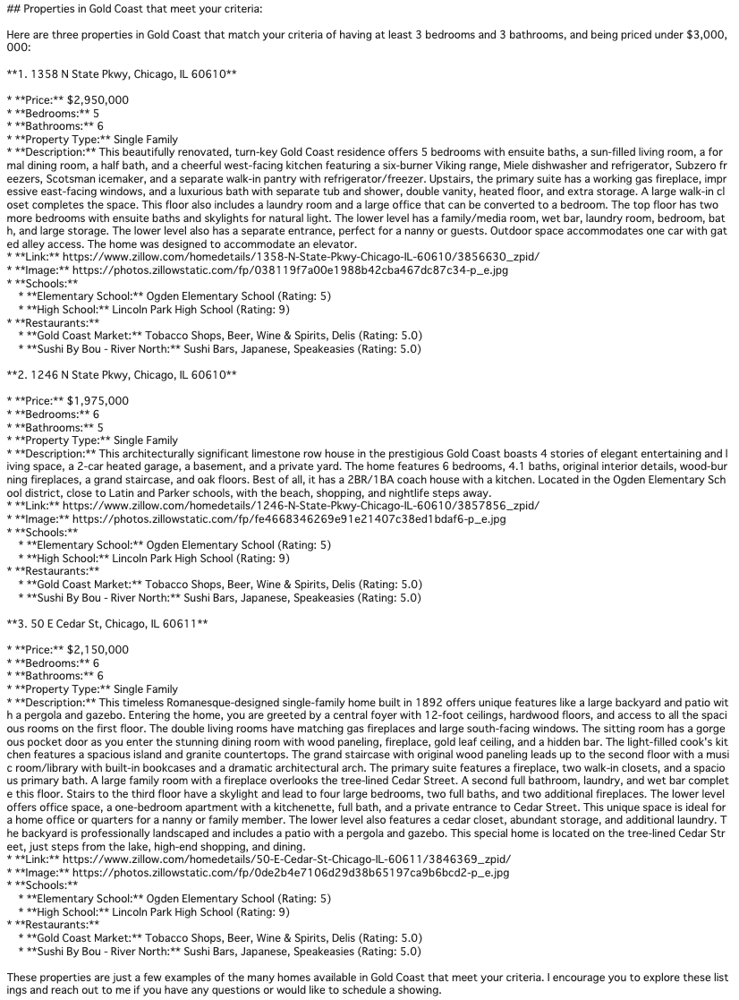
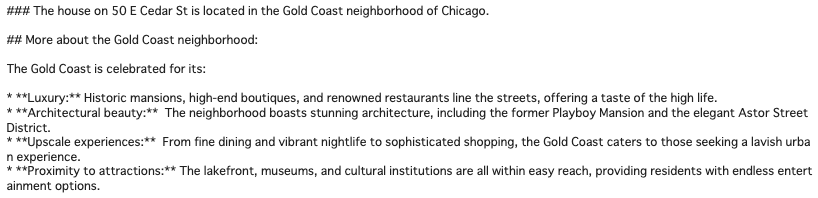

- 

  

# 
InternationAlly

**InternationAlly** is an AI-powered assistant designed to simplify the transition for international students moving abroad. Developed under the **PropertyPilot** platform — a visionary initiative aiming to transform the property search and advisory process through AI-driven solutions - InternationAlly is our first specialized product offering, focusing on the unique needs of international students.

## Table of Contents
- [1. Motivation](#1-motivation)
  - [Background](#background)
  - [Common Challenges Faced by International Students](#common-challenges-faced-by-international-students)
  - [Goals](#goals)
  - [Differentiators](#differentiators)
- [2. Overview of InternationAlly](#2-overview-of-internationally)
  - [Data](#data)
  - [Key Features](#key-features)
  - [Methodology](#methodology)
- [4. Evaluation & Testing](#4-evaluation--testing)
- [5. User Interface ](#5-user-interface)
- [6. Future Work](#6-future-work)
- [7. Conclusion](#7-conclusion)
- [8. References](#8-references)
- [9. Acknowledgements/About Us](#9-acknowledgementsabout-us)

  
## 1. Motivation

### Background

As the number of international students in the United States continues to rise, the need for effective support systems becomes increasingly vital. In the 2022/23 academic year, there were over 1 million international students in the U.S., reflecting significant growth from previous years.

Embarking on an academic journey abroad is both exciting and challenging for international students. Navigating a new country, culture, and legal system can be overwhelming. While numerous platforms offer property listings or cultural tips, there's a lack of comprehensive solutions that address all the needs of international students in one place.

### Common Challenges Faced by International Students

- **Legal and Visa Requirements**: Questions like "What are the steps to apply for an F-1 student visa?" or "How do I maintain my visa status while studying?"
- **Housing**: Finding safe, affordable housing, understanding lease agreements, and determining the documents needed for renting.
- **Cultural Differences**: Navigating cultural norms, understanding social etiquette, and overcoming language barriers.
- **Logistical Issues**: Setting up bank accounts, getting health insurance, finding transportation options, and more.

InternationAlly bridges these gaps by providing tailored housing options, local insights, and essential support throughout a student's move.

### Goals

**InternationAlly** aims to:

- Provide an **efficient and comprehensive** way for international students to secure housing.
- Offer **guidance** on legal, cultural, and logistical matters to help students adapt smoothly.
- Act as a **trusted friend and advisor**, simplifying the complexities of moving abroad.

### Differentiators

- **Specialized Focus**: Tailored specifically for international students, unlike generic real estate platforms.
- **Comprehensive Support**: Combines housing search with legal guidance, cultural support, and logistical assistance.
- **Personalized Experience**: Utilizes AI to provide customized advice based on individual student needs.
- **Multilingual Support**: Offers assistance in multiple languages to overcome language barriers.
- **Community Building**: Connects students with peers and local communities for social integration.

---

## 2. Overview of InternationAlly

### Data

- **Housing Data**: Aggregated from platforms like Zillow, tailored to meet the preferences of international students.
- **Local Information**: Collected from reliable sources to provide insights into neighborhoods, schools, transportation, and cultural hotspots.
- **Legal and Logistical Content**: Curated from official websites and verified resources to offer accurate guidance on visas, legal rights, and essential services.
- **Cultural Resources**: Compiled from blogs, forums, and community guides to assist with cultural adaptation.

### Key Features

- **Efficient Housing Search**: Natural language property search converting user input into specific filters.
- **Comprehensive Guidance**: Offers legal, cultural, and logistical support to help students adapt to their new environment.
- **Multilingual Support**: Provides assistance in multiple languages to cater to non-native English speakers.
- **Personalized Assistance**: AI-driven recommendations and advice tailored to individual needs and preferences.
- **Community Connection**: Facilitates connections with other international students and local communities.

### Methodology

- **Retrieval-Augmented Generation (RAG)**: Implemented to provide accurate and context-specific information by integrating a language model with a retrieval system.
- **Large Language Models (LLMs)**: Utilizing Gemini 1.5 Pro for natural language understanding and generation.
- **Multi-Shot Prompting**: Employed to convert user input into actionable queries for APIs like Zillow.
- **Data Integration**: Combining various data sources to create a cohesive and comprehensive knowledge base.

---

## 4. Evaluation & Testing

### Evaluation Framework and Results

- **User Testing**: Conducted with international students to gather feedback on usability and relevance.
- **Performance Metrics**: Measured accuracy of responses, relevance of housing recommendations, and effectiveness of guidance provided.
- **Iterative Improvements**: Feedback used to refine the model prompts and enhance the user experience.

---

## 5. User Interface

### Application

[**Link to Streamlit App**](https://property-pilot-app-617571939826.us-central1.run.app/)

### Demo

- **Initial Search:** "I am looking for an 1 bedroom apartment close to Chicago downtown campus within 2200 dollars per month."

- **Initial Search:** "I am looking to purchase a house in Gold Coast, Chicago. I would like to have a minimum 3 bedrooms and 3 bathrooms. I want to pay less than $3,000,000."

- **Inquiry about a Specific Property:** "Can you tell me more about the house on Cedar St?"

- **Neighborhood Information:** "Which neighborhood is the third house located in? Tell me more about that neighborhood."

- **Nearby Schools:** "What are some good schools nearby the third house?"

- **Restaurant Recommendations:** "What restaurants are nearby the house? Please provide me with the yelp link"

---

## 6. Future Work

- **PropertyPilot's Vision: Expanded Product Offerings**
  - Develop additional specialized agents catering to diverse user groups such as first-time homebuyers, recent graduates, and military families.
  - Create an integrated platform where users can access tailored real estate assistance.
- **Expand Cities/Schools**:
  - Extend InternationAlly's services to other major cities and universities across the United States and eventually globally.
- **Enhanced AI Capabilities**:
  - Integrate more advanced AI models to improve personalization and accuracy.
- **Community Features**:
  - Introduce forums and events to foster community among international students.
- **Partnerships**:
  - Collaborate with universities, housing providers, and service companies to offer exclusive benefits to users.

---

## 7. Conclusion

**InternationAlly** provides international students with a convenient, comprehensive, and personalized way to navigate the challenges of moving abroad. By combining advanced technology with expert guidance, our platform empowers students to make informed decisions and confidently embark on their academic journeys. InternationAlly not only facilitates housing searches but also offers essential support in legal matters, cultural adaptation, and logistical arrangements, making it an indispensable tool for international students.

Convert uncertainty into confidence with InternationAlly — your ally abroad.

---

## 8. References

- **Data Sources**:
  - Zillow API
  - Local government and university websites
  - Cultural blogs and forums
  - Neighborhood safety information from resources like NeighborhoodScout

- **Technologies Used**:
  - Gemini 1.5 Pro LLM
  - Retrieval-Augmented Generation (RAG) methodology

---

## 9. Acknowledgements/About Us

**InternationAlly** is developed by:

- **Kshitiz Sahay** (sahayk@uchicago.edu)
- **Daichi Ishikawa** (daichi@uchicago.edu)
- **Yijing Sun** (yijingsun@uchicago.edu)
- **William DeForest** (wdeforest@uchicago.edu)

**Advised by**:

- **Nick Kadochnikov**
- **Egehan Yorulmaz**
- **Scott Howard**

We are students in the Applied Data Science Master's program at the University of Chicago, working on this project as part of the Conversational AI Research Capstone Course.

---
